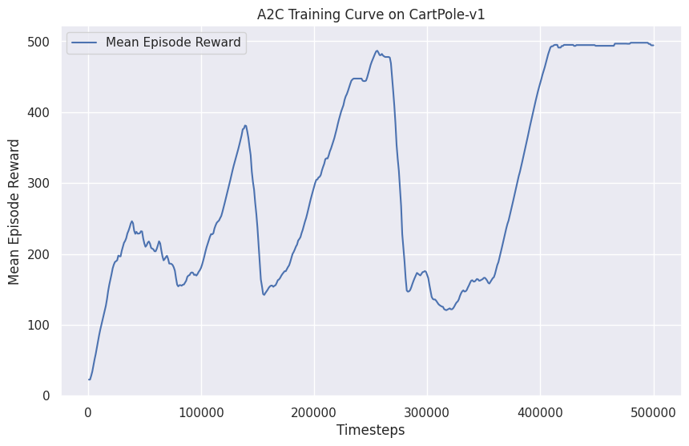
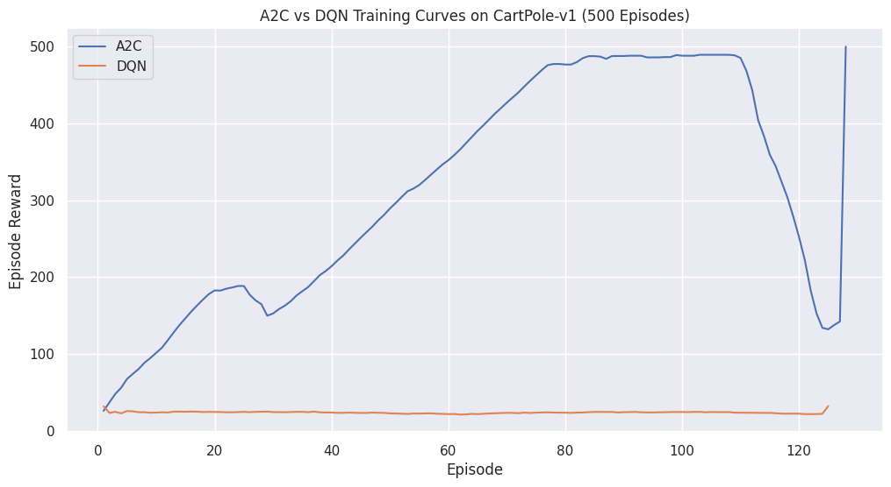
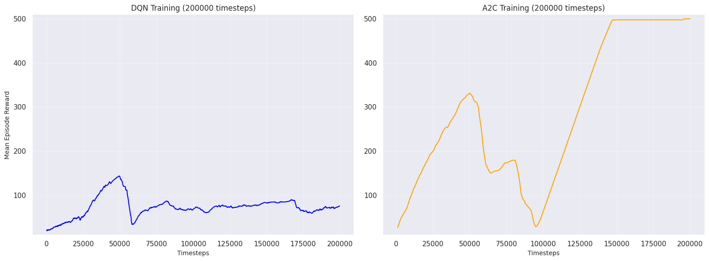
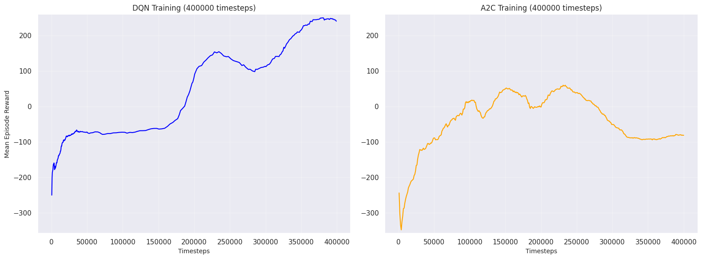

### A2C CartPole

To understand better the A2C algorithm and the best hyperparameters for it, the cartpole environment was loaded with an agent using said algorithm and the best set of parameters for it were:

```python
model_a2c = A2C(
    policy="MlpPolicy",
    env=env,
    learning_rate=0.0007,  
    n_steps=10,            
    gamma=0.99,            
    gae_lambda=1.0,      
    ent_coef=0.0,         
    vf_coef=0.5,           
    max_grad_norm=0.5,     
    device='cpu'
)
```
And its learning curve can be seen below:
<p align="center">
    <br>
</p>


with those parameters the agent successfully learned to solve the environment with an average evaluation reward of:

```python
Mean reward: 500.0 +/- 0.00
```

which was the best amongst agents trained with default and other parameters. Also, forcing the agent to run on the cpu greatly improved the execution time, as it seems a2c cannot leverage the gpu's capabilitys efficiently.

### A2C vs DQN CartPole

#### Training
A stable baseline DQN based agent was loaded with the ideal parameters for DQN found in the previous assignment. Even though the A2C agent managed to successfully solve the environment, again, the DQN agent proved unsuccessfull.

<p align="center">
    <br>
</p>

By loading the follwing parameters in DQN, its training improved, but it was not able to replicate the same performance observed in A2C:

```python
model_dqn = DQN(
    policy="MlpPolicy",
    env=env,
    learning_rate=0.001,
    buffer_size=50000,
    batch_size=64,
    gamma=0.99,
    target_update_interval=500,
    exploration_fraction=0.2,
    exploration_initial_eps=1.0,
    exploration_final_eps=0.05,
    learning_starts=1000,
    device='cpu',
)
```
<p align="center">
    <br>
</p>

##### Evaluation

```
A2C Mean reward: 500.0 +/- 0.00
DQN Mean reward: 96.9 +/- 5.37
```

Evaluation shows that even with the new parameters which were suggested by [DQN_hyper](https://adgefficiency.com/dqn-tuning/) I could not get it to learn the environment. I expect that it would demand many more training steps, as in the previous assignment it took the good portion of an hour to get it tuned.


### Lunar Lander

#### Training
In the lunar Lander environment, however, as was seen in a previous assignment, the DQN was able to successfully complete the environment. But the A2C got stuck in a local minima:


<p align="center">
    <br>
</p>
No greater amount of training was able to free the a2c agent from that minima, more parameter exploration would be needed. 

##### Evaluation
their respective evaluation results also show that only the DQN was able to successfully solve the environment this time around:
```
A2C Mean reward: -45.15782049999999 +/- 56.16
DQN Mean reward: 250.49320140000003 +/- 65.50
```
in this environment rewards above 200 are considered successfull.

### Breakout
#### Training
